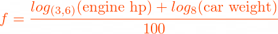

# Inheritance Tasks

В коя секция 'отиват' член данните на базовия клас при наследяване:
| Видимост в базовия клас | Видимост при `public` наследяване в производния клас | Видимост при `protected`  наследяване в производния клас | Видимост при `private`  наследяване в производния клас |
|-------------------------|------------------------------------------------------|----------------------------------------------------------|--------------------------------------------------------|
| `public`                | `public`                                             | `protected`                                              | `private`                                              |
| `protected`             | `protected`                                          | `protected`                                              | `private`                                              |
| `private`               | няма достъп                                          | няма достъп                                              | няма достъп                                            |

<br>

## Задача 1

**!!Трябва да гарантирате правилно изпълнение на програмата и да прихващате всички изключения правилно, като се опитвате да държите обектите в максимално валиден state при проблеми!!**

Позволено е да добавяте свои функционалности и различни помощни методи, стига да се достигне до правилно решение на задачата. При писането на задачата се опитвайте да мислите, как вие бихте използвали класовете, ако сте външен програмист, който не е виждал до сега кода.

Трябва да си създадем кола за да може да правим състезания!

**(a)** Създайте клас `CarPart`, описващ част за кола.

Всяка част за кола има:
- идентификатор;
- име на производител;
- описание.

Всички са низове с произволна дължина.

**(б)** Основно ни трябват двигатели, гуми и акумулатори.

*Гумите* имат:
- широчина в мм – между 155 и 365;
- профил – между 30 и 80;
- диаметър в инчове – между 13 и 21.

*Двигателите* се характеризират с 
- конски сили

*Акумулаторите* имат:
- капацитет – в ампер-часове;
- battery id – идентификатор, независим от този за всяка част (низ с дължина от 15 символа)

Реализирайте подходящи класове за различните части.

Създайте и подходящи оператори `<<`, които да извеждат информация за част в следния формат:
- за двигател:
```
(<id>) by <manufacturer> – <description> – <horsepower> hp
```
- за гума:
```
(<id>) by <manufacturer> – <description> – <width>/<profile>R<rim size>
```
- за акумулатор:
```
(<id>) by <manufacturer> – <description> – <amp hours> Ah
```

Създайте операторите с минимална дупликация на код.

**(в)** Почти сме готови да си сглобим кола, но се нуждаем от място, където ще държим горивото.

Направете подходящ клас `FuelTank` за целта.

Един резервоар има капацитет и пълнота към момента. И двете стойности се измерват в литри и са реални числа.

Създайте конструктор, приемащ капацитет на резервоара.
Всеки нов резервоар първоначално е пълен.

Създайте методи:
- за използване на дадено количество гориво:
  ```cpp
  void FuelTank::use(double amount);
  ```

- за зареждане на дадено количество гориво:
  ```cpp
  void FuelTank::fill(double amount);
  ```

При зареждане на прекалено много гориво, резервоарът остава пълен.

При опит за използване на количество гориво, повече от наличното, да се хвърля custom изключение `insufficient_fuel_error`.

Изключението трябва да е пряк наследник на `std::logic_error` и да може да се създава такова с единствен параметър – съобщение, описващо грешката.

**(г)** Реализирайте клас `Car`, използвайки частите, които създадохте.

Една кола има поне:
- резервоар;
- двигател;
- 4 гуми;
- акумулатор;
- изминати километри;
- тегло (в кг).

Създайте конструктор за кола, приемаща всички нужни член данни, както и капацитет на резервоара.

Създайте get-ър за резервоара:
```cpp
const FuelTank& getFuelTank() const;
```

Създайте член-функция `drive(double km)`.
Резултатът от изпълнението на функцията е:
- добавя се дистанцията към изминатите километри;
- намалява се количеството гориво в резервоара с произведението на `km` и изразходваното гориво на 1 км;
горивото, използвано за 1 км се смята по следната формула:



Ако колата няма достатъчно гориво, не се променя състоянието ѝ по никакъв начин.

**(д)** Създайте външна за класа функция за драг състезание между две коли:
```cpp
Car* dragRace(Car* car1, Car* car2);
```

To се случва на разстояние 0.4 km (1/4 mile).
Функцията трябва да връща `Car*`, сочейки към евентуалния победител от него.

Ако една от колите няма достатъчно гориво, за да измине разстоянието, другата печели.

Ако и двете коли **нямат** достатъчно гориво, да се върне `nullptr`.

Ако и двете коли **имат** достатъчно гориво, победителят се определя от съотношението:


Колата с по-високо съотношение печели.
